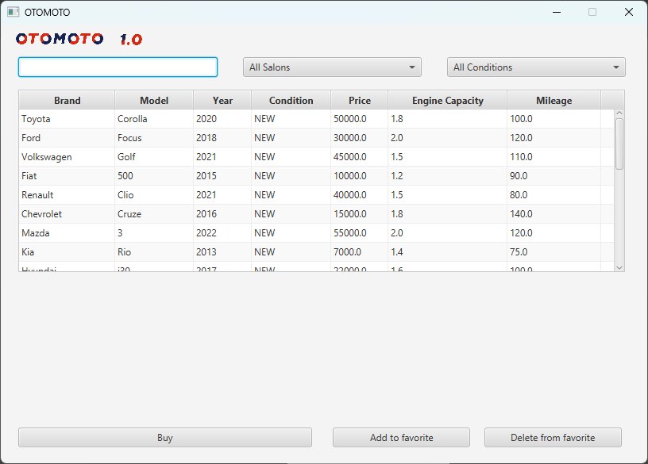
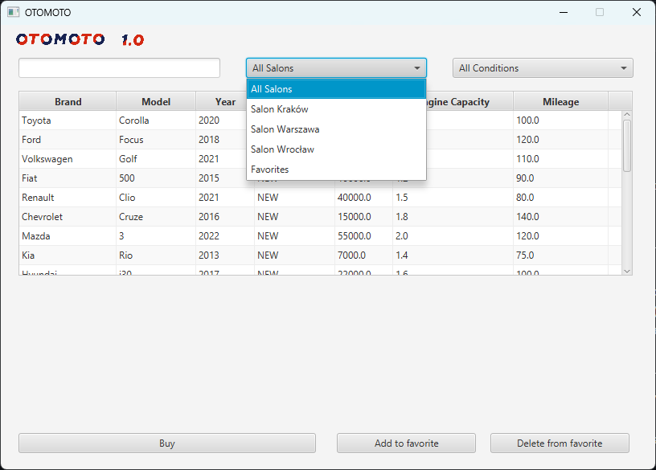
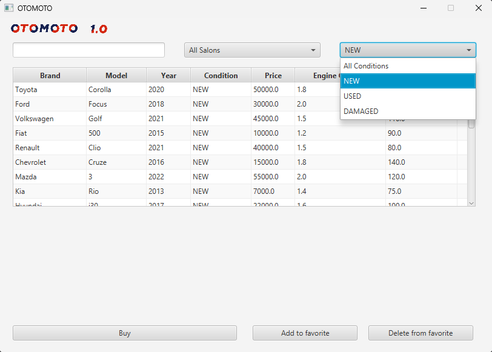
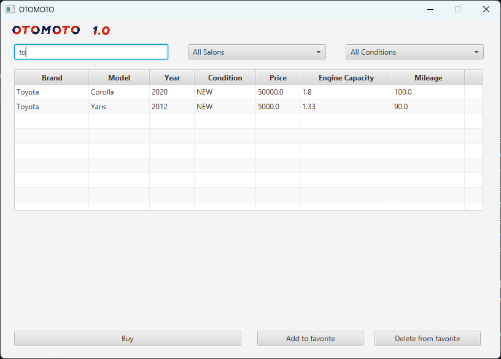
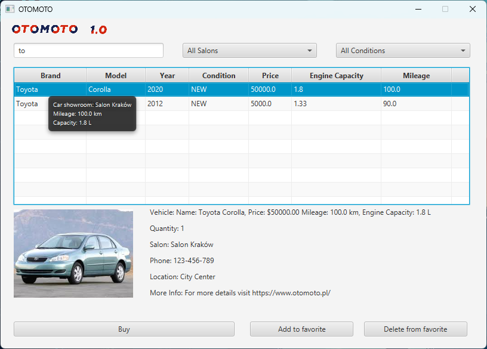
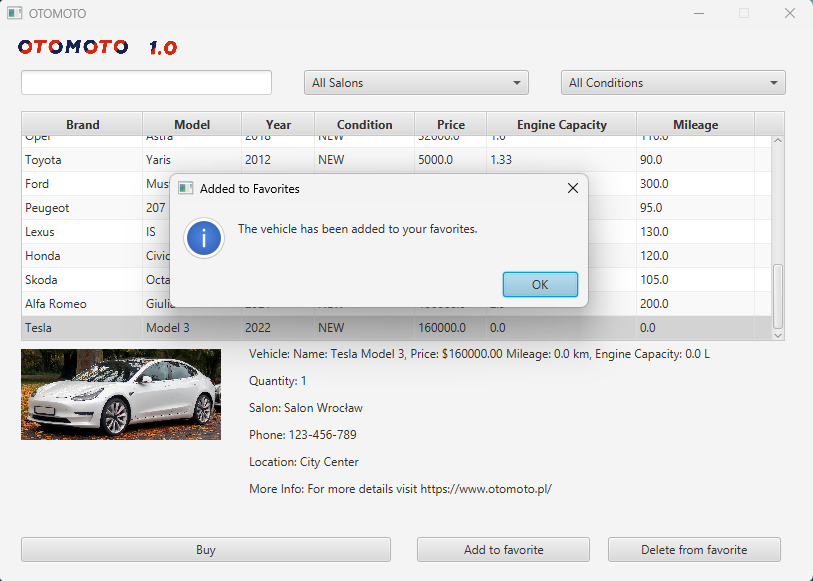
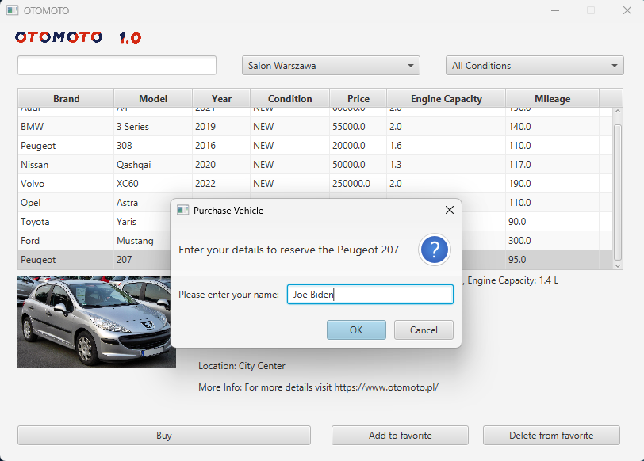
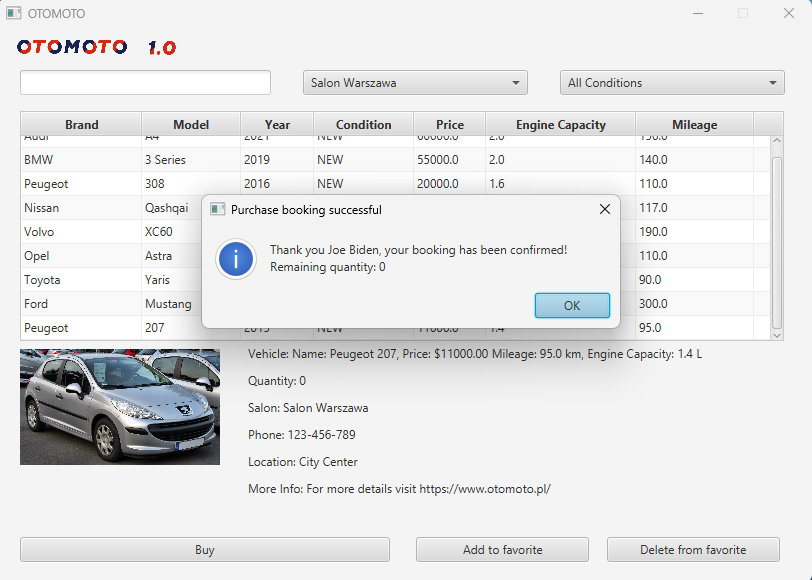
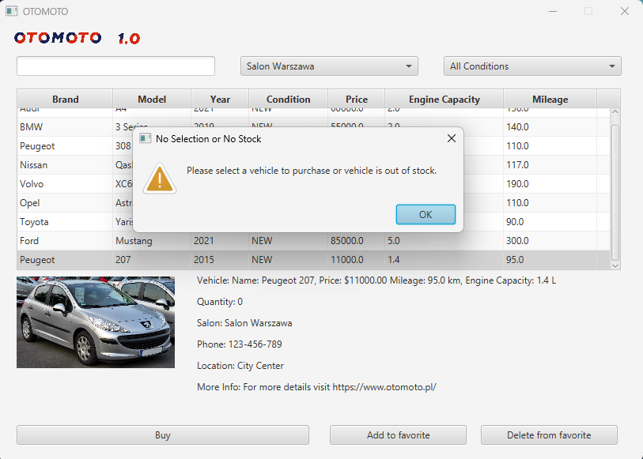

<h3>Lab06 - JavaFX</h3>

implementacja aplikacji klienckiej do obsługi salonu

  

Zadania
1. Do niniejszego projektu wykorzystaj API salonów samochodowych z poprzednich zajęć.
Rozbuduj je o dodatkowe pola, metody i klasy. Zainspiruj się stronami internetowymi tj.
Otomoto, aaaauto itd.
2. Zaimplementuj funkcjonalności aplikacji klienckiej do obsługi zakupów w salonie:
1. Użytkownik może wybierać salon (bądź miasto*) przy użyciu listy lub pola rozwijalnego
(ComoBox). Lista powinna zawierać opcję _dowolny_, która pozwoli na wyszukiwanie
produktów we wszystkich salonach.

  
  

3. Domyślnym widokiem powinna być lista wszystkich pojazdów z wszystkich salonów. Do
tego celu można wykorzystać dowolny komponent mający strukturę tabelaryczną.
Powinna ona być sortowalna względem przynajmniej: nazwy (alfabetycznie), ceny, roku
produkcji. Każdy rekord powinien zawierać co najmniej: nazwę produktu, cenę, roku
produkcji oraz w jakim salonie (mieście) się on znajduje.
4. Istniej możliwość wyszukiwania produktów po ich nazwie. Wystarczy wyszukiwanie
wprost.

  

6. Lista dostępnych produktów, spełniających kryteria wyszukiwania ma być wyświetlona w
formie tabeli z punktu 2.
7. Po najechaniu kursorem na samochód ma wyświetlać się _Tooltip_ z informacjami
szczegółowymi, np. opis salonu, w którym się produkt znajduje, przebieg, silnik.

  

9. Aplikacja powinna umożliwiać rezerwację/zakup samochodu, ewentualnie kontakt ze
sprzedającym. Należy dokonać weryfikacji poprawności danych, np. samochód nie jest
zarezerwowany/kupiony.

  

3. Funkcjonalność zakupu/rezerwacji samochodu z salonu może być zaimplementowana na dwa
sposoby:
* Rezerwacja produktu. Wówczas samochód nadal będzie dostępny w salonie, natomiast klient
będzie widział zarezerwowane pojazdy.
* Kupno samochodu skutkujące usunięciem pojazdu z salonu. Nie ma możliwości przeglądnięcia
historii zakupów.

  
  
  

